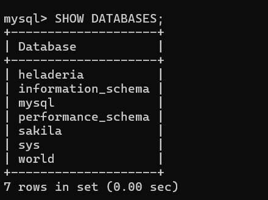
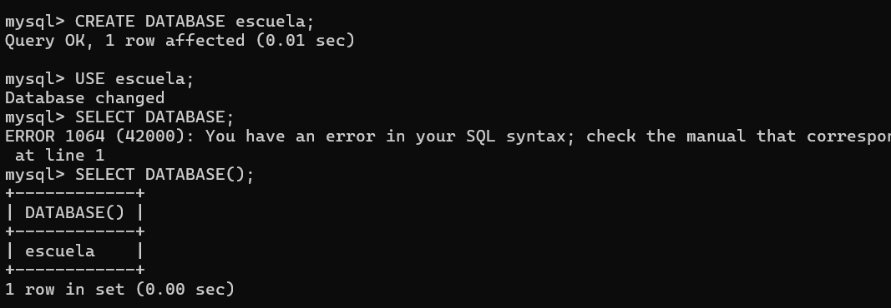
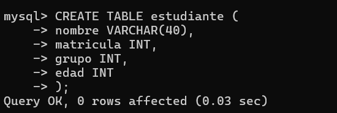
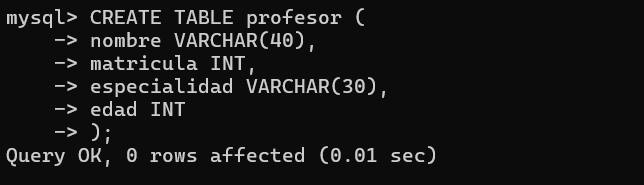
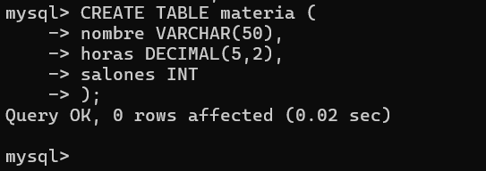
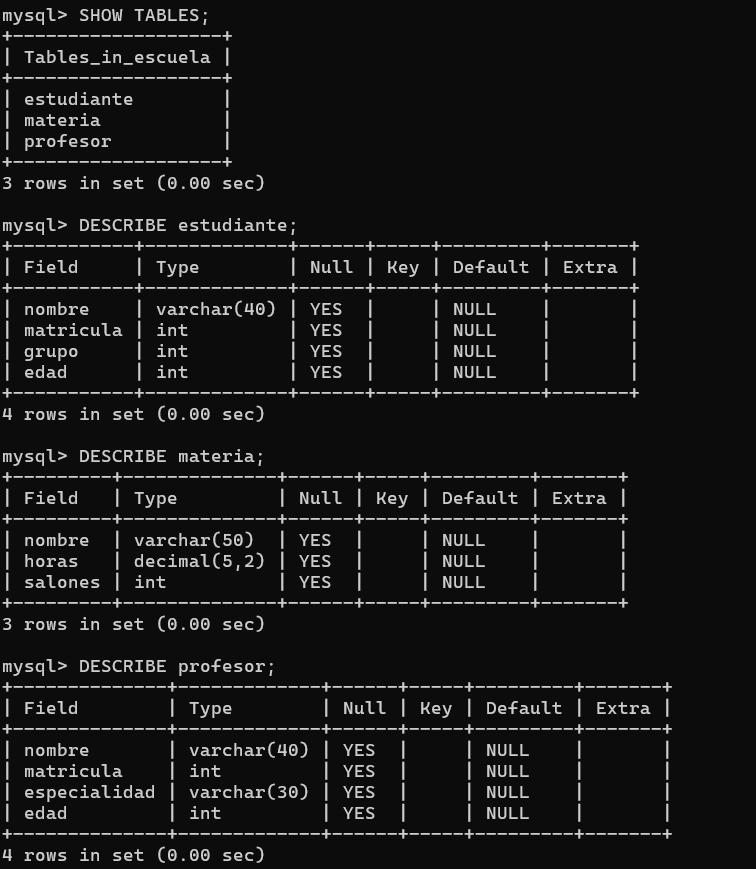

# **~ Evidencias de la práctica ~**

## 1-. **Bases de datos existentes**

  
Primero vi qué bases de datos tenía en mi servidor utilizando el comando `SHOW DATABASES;`.
## 2-. **Creación de mi base de datos**

Lo siguiente fue crear una base de datos llamada **escuela** utilizando el comando `CREATE DATABASE`. Y ubicarme dentro de la base con el comando `USE escuela`. Luego, para verificar que efectivamente estaba en la base de datos **escuela**, utilicé `SELECT DATABASE()`.

## 3-. **Creación de la tabla estudiante**

  
Después creé la tabla **estudiante**, definiendo 4 columnas y asignando un tipo de dato a cada una.

## 4-. **Creación de la tabla profesor**

Posteriormente creé la tabla **profesor**, agregando igualmente 4 columnas y sus tipos de datos.

## 5-. **Creación de la tabla materia**

  
Y para terminar, creé la tabla **materia**, definiendo 3 columnas y sus tipos de datos.

## 6-. **Comprobación de las tablas**

Ya por último, para comprobar que las tres tablas fueron creadas de forma correcta, utilicé el comando `SHOW TABLES`, donde se mostraron las tres tablas de mi base de datos **escuela**. También utilicé `DESCRIBE` en cada tabla para visualizar las columnas y algunas características más.

